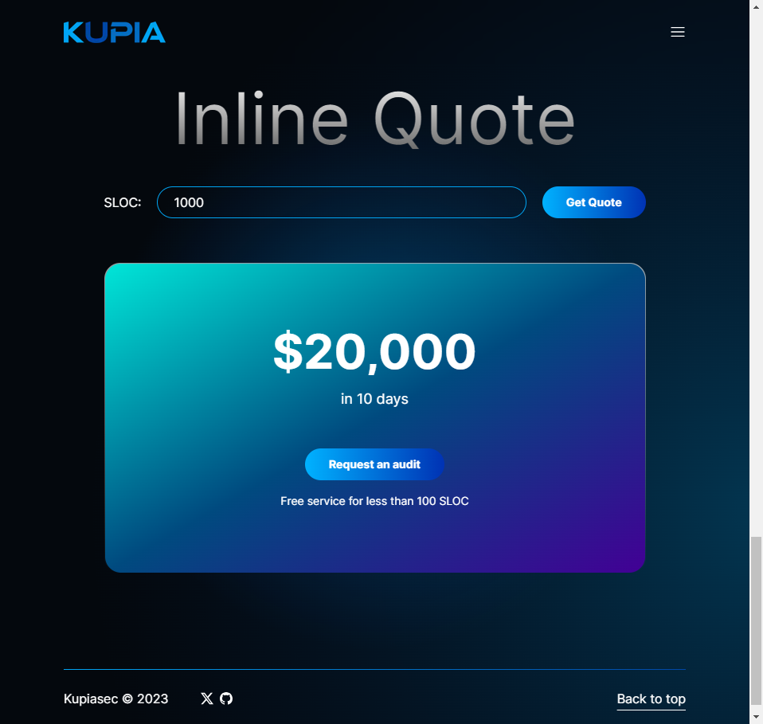

# Step 1: Connect

Initiate your smart contract security journey by reaching out to KupiaSec.&#x20;

At KupiaSec, we believe in clarity and openness, especially when it comes to pricing.&#x20;

We apply a flat rate based on your codebase size measured by SLOC (Solidity Lines Of Code).

$$Days=\lceil SLOC/100 \rceil$$

$$Price=Days * \$2000$$ (USD)

For example, if the codebase has 1000 lines of Solidity code, the quote is calculated as 20000USD / 10 days.

You can try our inline quote tool on our [website](https://www.kupia.io/#inline-quote).

<figure><figcaption>
Inline Quote
</figcaption></figure>

Fill in the form to provide more information that can help us understand your needs. Our team will get back to you and schedule a call.

[Reach Out Now](https://tally.so/r/nWrWgR)🤝

**Note**: Payment will be requested 50% upfront and 50% on the final report delivery.
