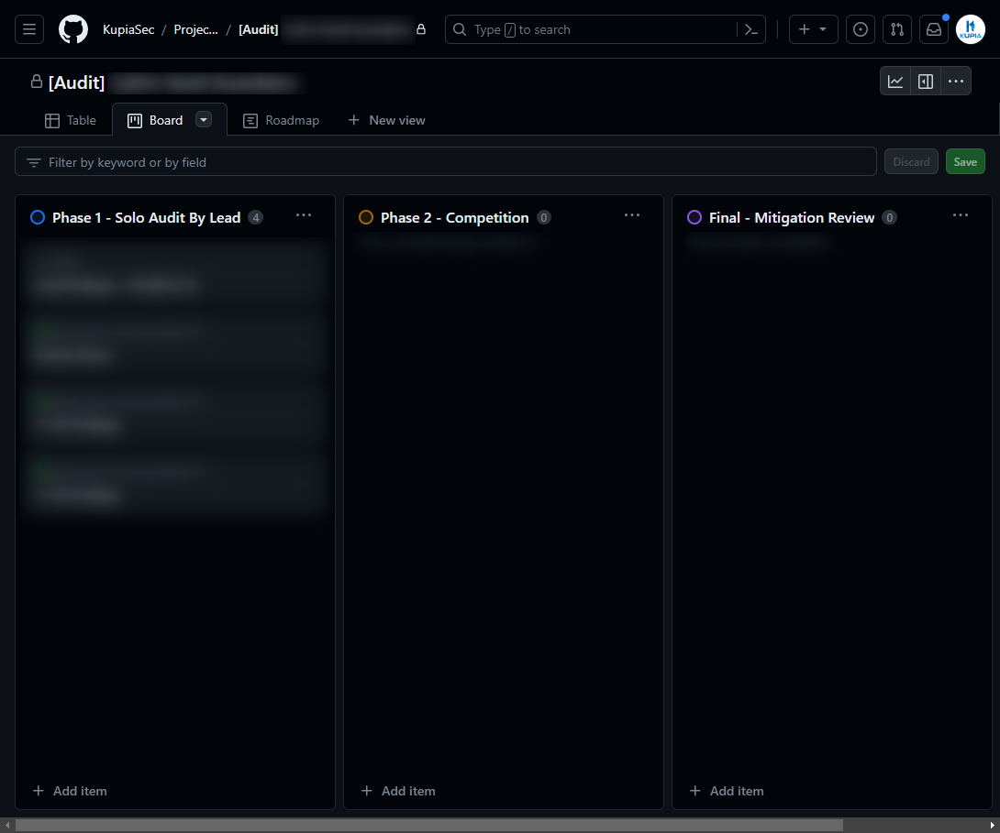

# Step 2: Audit Kickoff

Upon selecting KupiaSec as your smart contract security partner, engage in a kickoff call. This session is designed to establish clear communication channels, discuss project specifics, and set expectations for the audit process.

By default, Kupia will organize a MPA process with the lead auditor selected based on our internal process.&#x20;

Generally, each phase will be designed as below:

* Phase 1 - Solo Audit by a Lead Auditor\
  30% of the time is allocated and 30% of the total reward is given to the lead auditor.
* Phase 2 - Internal Competition\
  60% of the time is allocated and 40% of the total reward is given to the participants.
* Phase 3 - Mitigation Review\
  10% of the time is allocated.

**Note 1:** Kupia takes 30% of the total payment for management & operation and 70% is paid to the auditors. (total reward = total payment \* 70%)

**Note 2: 3**0% of the total reward is reserved as a bonus for the lead auditor or the competition participants. In a word, the lead auditor and the community auditors compete to find as many vulnerabilities as possible.

**Note 3:** Mitigation review starts after the protocol team comes back with the mitigations.

The whole process is transparent.

We will set up a GitHub project board where all findings will be tracked in real-time and invite protocol team members as well for discussion.

<figure><figcaption>
Findings are tracked on GitHub project board
</figcaption></figure>
